# Introduction

---

### Vous

 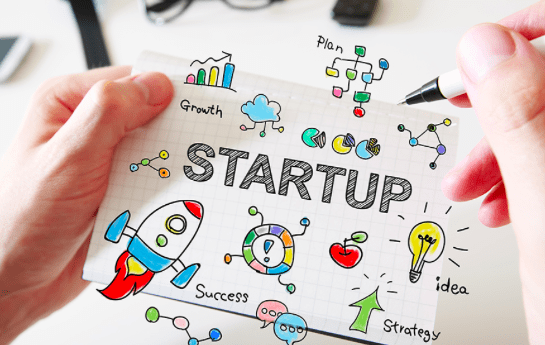
 

---

### Nous

 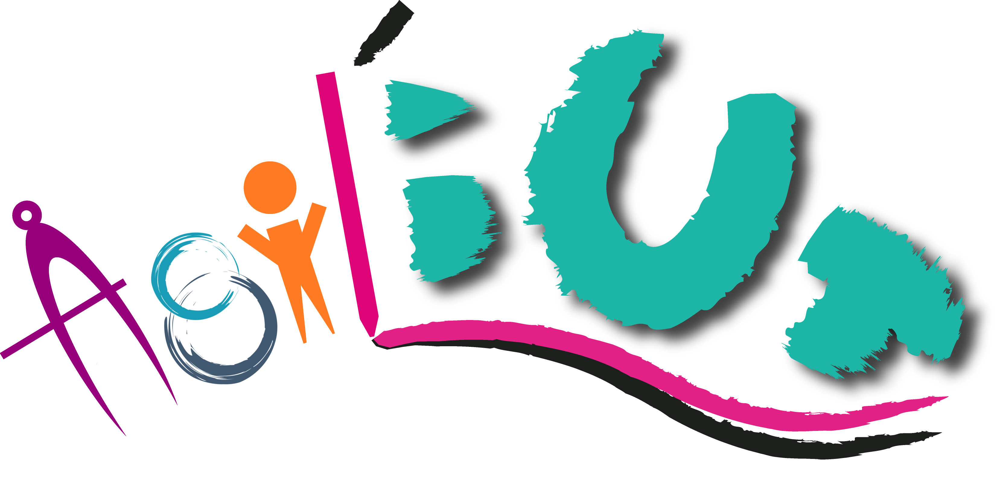

### Le concept

 

### La méthode
 
 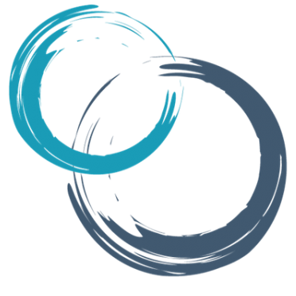

### Attention

 

 

 Présentation au client **mercredi 06 avril 2022** à partir de  **08h30**.

 

# Le thème

---

### Le projet

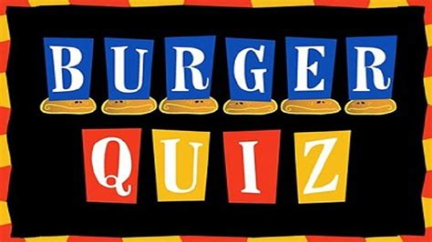

# Les règles du jeu

---

### Les moyens humains

 

 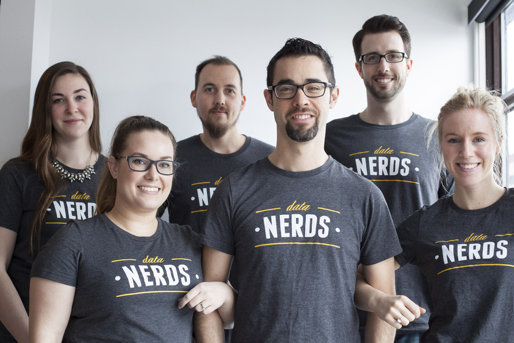

 Quelques développeurs(ses)

 

---

### Les aides

 

  

 Possibilité de faire appel à un **prestataire extérieur**

   

 Attention au tarif ! 

  

 Ils acceptent de répondre à des petites questions *gratuitement*.

 

---

### Des consultants juniors

 

 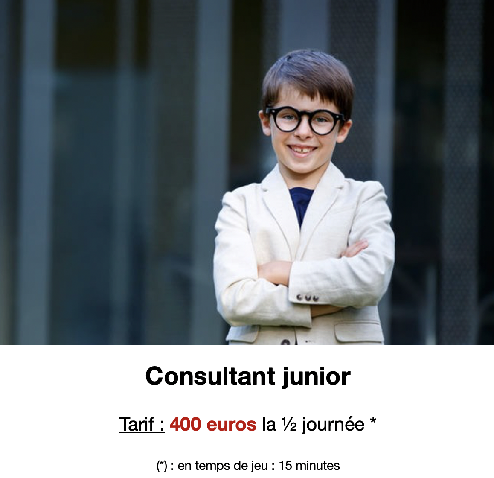
 

---

### Des consultants seniors 

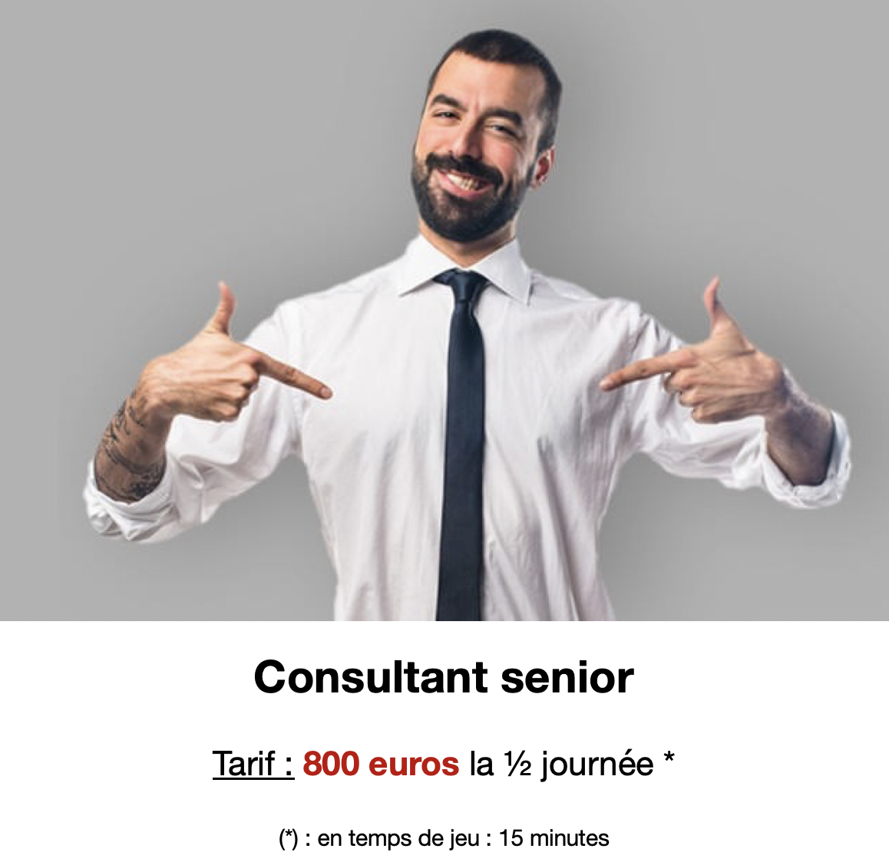

---

### Les moyens techniques 

 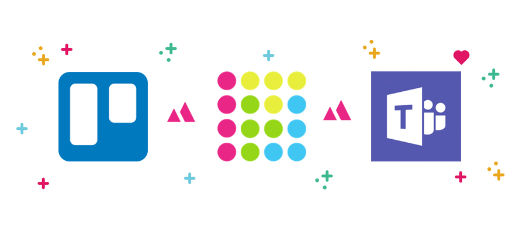

---

### Les outils exigés par le client 

   

 * git + [Gitlab](https://gitlab.univ-artois.fr)
 * [Mattermost](https://mattermost.univ-artois.fr)

--- 

### Langage de programmation à utiliser

 

 <ul>  </ul>
 <ul>  </ul>
  <b>AngularJS</b> ou <b>Laravel</b>
 

---

### Les moyens financiers

 

 
  Un budget "conséquent" pour mener le projet
 

---

### Le budget : 2000 euros

 

 
 

---

### La deadline

 

---

### La langue 

 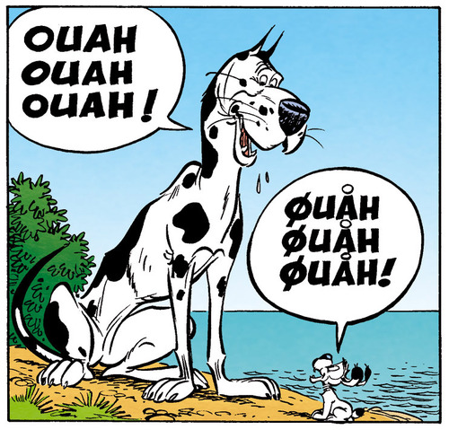

---

### La distance 

 

---

### La localisation

 Vous allez travailler dans 3 pays francophones : 

 * Belgique (13E), 
 * Suisse (12E),
 * Québec (15E),
 * France (04X).

---

### La loi de Murphy

 

 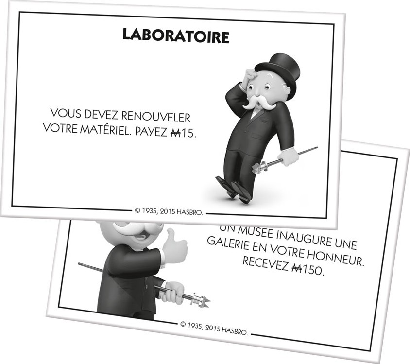 
 ... ou loi dite "de la tartine beurrée ! 
 <b>Des événements aléatoires pourront affecter le fonctionnement de votre projet.</b>
 

# Les attendus

---

### Une application 

 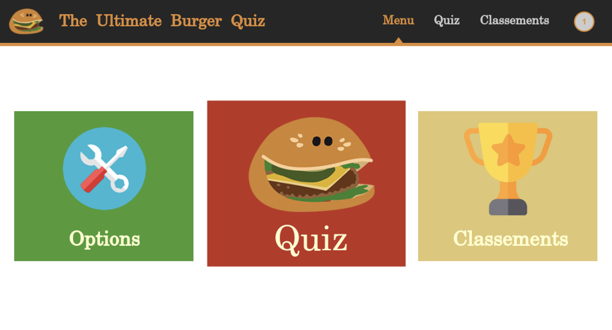

---

### Une soutenance 

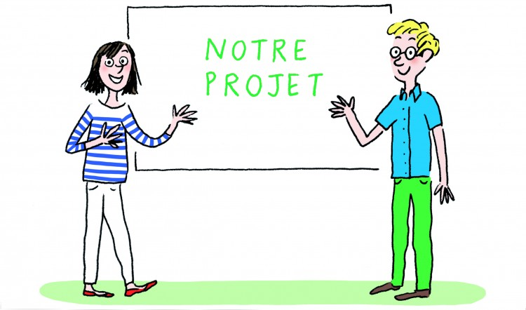

# Tout est ok ? 

---

### Prochaine étape

 

 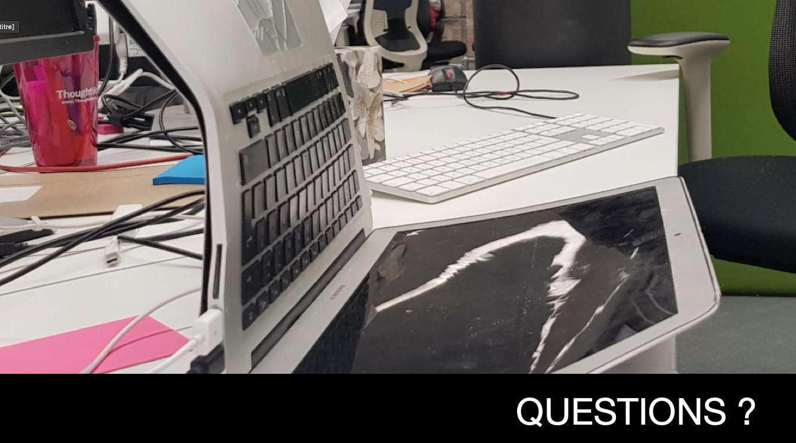 
 La prochaine réunion est un  **planning poker** 
 
